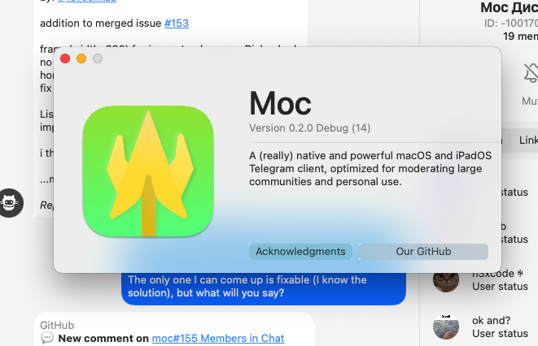
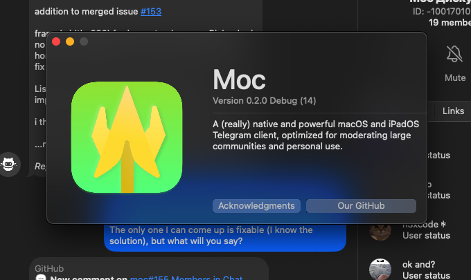

<p align="center">
  
</p>

<h1 align="center">Moc</h1>

<p align="center">
A (really) native and powerful Telegram client for macOS and iPadOS, optimized
for moderating large communities and personal use. 
</p>


[](https://github.com/mock-foundation/moc/actions/workflows/build.yml)
[](https://opensource.org/licenses/)
[]() 

[](https://vshymanskyy.github.io/StandWithUkraine/)

This client is currently **in development** and **barely usable**. You can track progress by observing the [project table](https://github.com/orgs/mock-foundation/projects/2), [issues](https://github.com/mock-foundation/moc/issues), [pull requests](https://github.com/mock-foundation/moc/pulls), and a [Telegram channel](https://t.me/moc_updates_ua) (russian, and soon ukrainian).

Project roadmap: [Craft](https://www.craft.do/s/rmUOSbIPXTVbCY)

If you have any questions, ask them in [Discussions](https://github.com/mock-foundation/moc/discussions) on GitHub, or in a [Telegram group](https://t.me/moc_discussion) (ukrainian/russian). You are **strongly** encoruaged to use Discussions and the Telegram group instead of Issues for questions. Bug reports and stuff go to Issues. There is a reason why GitHub created Discussions in the first place :D

# Installation

You can install the latest release using Homebrew, GitHub, and MS AppCenter:

## Homebrew

This is a preferred method of installation:

```shell
brew install --cask ggoraa/apps/moc
```

By the way, Moc will soon move from a custom tap to an official one, homebrew-casks!

## GitHub

You can find any release in the [Releases](https://github.com/mock-foundation/moc/releases) page of this
repository.

## AppCenter

You can also find releases from [MS AppCenter Moc page](https://install.appcenter.ms/orgs/mock-foundation/apps/moc/distribution_groups/releases). By the way,
this is a place from which the in-app updated fetches updates :)

# OS support

Moc's OS support model is N-1, which means "latest and previous major release",
for example macOS 13 and 12. When there is a new OS release announced, Moc 
will get ready to drop support for an oldest release. For example, if 
there is macOS 13 and 12 supported, and then macOS 14 is announced, the development
team will start to remove code for supporting the macOS 12 release, and a new release
with macOS 12 support removed will be available right after a stable release of macOS
14.

# Screenshots





# Contributing

If you want to contribute a new feature, please make sure you have read the [project roadmap](https://www.craft.do/s/rmUOSbIPXTVbCY). This may guide you what are current goals of the project :D

# Building

## Step 1 - Clone

Use the command below to clone the repo and its submodules:

```shell
git clone --recurse-submodules https://github.com/mock-foundation/moc.git 
```

## Step 2 - Download right version of Xcode

The development is going with **Xcode 14 beta**. You can download it from
[Apple Developer](https://developer.apple.com/download/release/).

## Step 3 - Obtain `api_id` and `api_hash`

They can be obtained [here](https://my.telegram.org/). Log in, open **API development tools**, and fill up needed info. Then click **Save changes**
at the bottom of the page. Leave the page open, this will be needed in the next step!

## Step 4 - Set up development environment

Be sure that you have [Homebrew](https://brew.sh) installed, because it is used a lot here.

Now run these commands:
```shell
brew install swift-sh
sudo chmod +x environment.swift 
sudo chmod +x gyb.sh
./environment.swift <api_id> <api_hash>
```

**Done!** You have everything set up. You can now build Moc 😁
